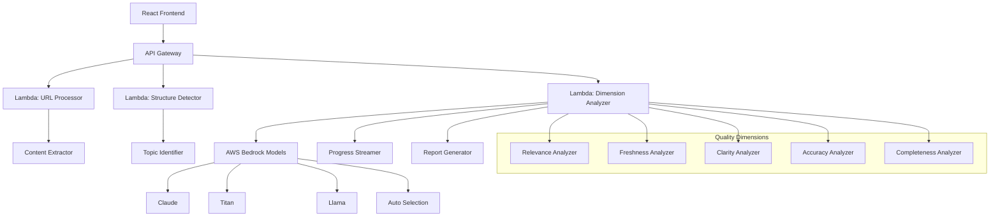
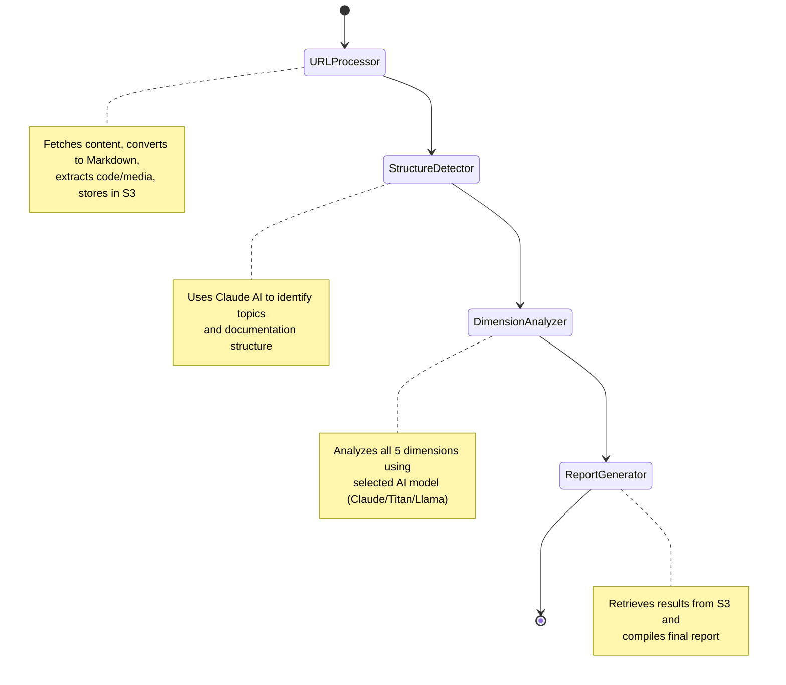
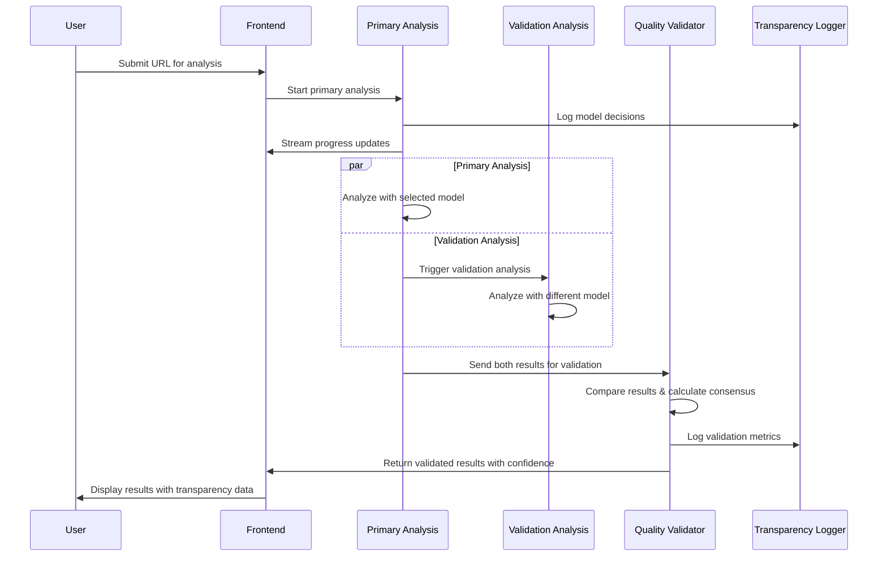

# Design Document: Documentation Quality Auditor

## Overview

Lensy is a web-based documentation quality auditor that analyzes developer documentation URLs and provides comprehensive quality reports. The system uses a React frontend with AWS Lambda backend, leveraging AWS Bedrock's multi-model capabilities for AI-powered analysis. The architecture supports real-time progress streaming, graceful degradation, and configurable model selection.

## Architecture

### High-Level Architecture



### Component Architecture

The system follows a microservices pattern with distinct Lambda functions for each major operation:

1. **Frontend Layer**: React SPA with real-time WebSocket connections
2. **API Layer**: AWS API Gateway with WebSocket support for streaming
3. **Processing Layer**: Multiple Lambda functions for parallel processing
4. **AI Layer**: AWS Bedrock integration with model selection logic
5. **Streaming Layer**: WebSocket connections for real-time progress updates

### Step Functions Workflow (Current Implementation)



**Key Architecture Decisions:**
- **S3 Storage**: All content and results stored in S3 to avoid Step Functions 256KB data limit
- **Minimal Responses**: Lambda functions return only success/failure status, not full content
- **Sequential Processing**: URL → Structure → Dimensions → Report (4 steps)
- **Quality Validator Removed**: LLM-as-Judge moved to Phase 2 as async background process

**Timeout Handling Strategy:**
- Each dimension analysis = separate Step Function state
- Individual timeouts: 5 minutes per dimension
- Retry logic: 2 attempts per dimension with exponential backoff
- Partial success: Generate report with available dimensions
- State persistence: Resume from last successful checkpoint

```typescript
interface StepFunctionState {
  analysisId: string;
  completedDimensions: string[];
  failedDimensions: string[];
  partialResults: Record<string, DimensionResult>;
  retryCount: Record<string, number>;
}
```

## Components and Interfaces

#### URLInputComponent
- **Purpose**: Handles URL submission and model selection
- **Props**: `onSubmit(url, model)`, `availableModels[]`
- **State**: `url`, `selectedModel`, `isAnalyzing`
- **Interface**: Renders input field, model dropdown, and analyze button

#### StructureConfirmationComponent
- **Purpose**: Displays detected structure for user confirmation
- **Props**: `detectedStructure`, `onConfirm()`, `onEdit()`
- **State**: `isEditing`, `editedStructure`
- **Interface**: Shows topic breakdown with edit capabilities

#### ProgressStreamComponent
- **Purpose**: Real-time progress display with streaming updates
- **Props**: `progressEvents[]`, `isComplete`
- **State**: `events`, `autoScroll`
- **Interface**: Scrollable progress log with status icons

#### QualityDashboardComponent
- **Purpose**: Final results display with scores and recommendations
- **Props**: `analysisResults`, `modelUsed`, `confidence`
- **State**: `expandedDimensions[]`, `filterSettings`, `viewMode`
- **Interface**: Score cards with expandable recommendation details
- **Future Enhancement**: Configurable/filterable report views for substantial content
- **Static Report**: Initial version shows fixed layout, expandable for future customization

### Backend Components

#### URLProcessor (Lambda)
- **Purpose**: Fetches content and creates clean Markdown representation using aggressive noise reduction pipeline
- **Input**: `{ url: string, selectedModel: string, sessionId: string, analysisStartTime: number }`
- **Output**: `{ success: boolean, sessionId: string, message: string }` (content stored in S3)
- **Dependencies**: 
  - `jsdom@^23.0.0` - HTML parsing and DOM manipulation
  - `turndown@^7.1.2` - HTML to Markdown conversion
  - `turndown-plugin-gfm@^1.0.2` - GitHub Flavored Markdown support
- **Processing Strategy**:
  1. **Fetch**: Retrieve raw HTML from URL with User-Agent header
  2. **Parse**: Use JSDOM to create traversable document
  3. **Remove Noise (DOM Level)**: Call `removeNoiseElements()` to remove 40+ types of noise elements
  4. **Extract Main Content**: Use `extractMainContent()` with WordPress-specific selectors
  5. **Convert**: Use Turndown with aggressive `remove()` configuration
  6. **Store**: Save to S3 with noise reduction metrics
- **Noise Reduction Implementation**:
  ```typescript
  // DOM-level removal (before Turndown)
  function removeNoiseElements(document: Document): number {
    const noiseSelectors = [
      // Scripts and styles (CRITICAL!)
      'script', 'style', 'noscript', 'link[rel="stylesheet"]',
      // Navigation and UI chrome
      'nav', 'header', 'footer', 'aside',
      '[role="navigation"]', '[role="banner"]', '[role="contentinfo"]',
      // WordPress.org specific
      '.site-header', '.site-footer', '#wporg-header', '#wporg-footer',
      '.wp-block-wporg-sidebar-container', '.wp-block-social-links',
      // Forms, media, hidden elements
      'form', 'input', 'button', 'textarea', 'iframe', 'embed', 'video', 'audio',
      '[style*="display:none"]', '.hidden', '.sr-only',
      // 30+ more selectors...
    ];
    // Returns count of removed elements for logging
  }
  
  // Content extraction with fallback strategies
  function extractMainContent(document: Document): Element {
    // Strategy 1: WordPress.org specific (.entry-content, .post-content)
    // Strategy 2: Generic containers (main, article, [role="main"])
    // Strategy 3: Fallback to document.body
  }
  ```
- **Turndown Configuration**:
  ```typescript
  function configureTurndownService(): TurndownService {
    const turndown = new TurndownService({
      headingStyle: 'atx',
      codeBlockStyle: 'fenced',
      bulletListMarker: '-'
    });
    
    // Add GFM plugin
    turndown.use(gfm);
    
    // Aggressive removal using built-in remove() method
    turndown.remove([
      'script', 'style', 'noscript', 'link',
      'nav', 'footer', 'header', 'aside',
      'form', 'input', 'button', 'textarea',
      'iframe', 'embed', 'object', 'video', 'audio',
      'meta', 'title', 'base'
    ]);
    
    // Custom rules for WordPress callouts and code blocks
    // ...
  }
  ```
- **Noise Reduction Metrics**:
  ```typescript
  interface NoiseReductionMetrics {
    originalSize: number;      // Raw HTML size (e.g., 176KB)
    cleanedSize: number;        // After noise removal (e.g., 15KB)
    reductionPercent: number;   // Percentage reduced (e.g., 91%)
  }
  ```
- **Logging**: Detailed logs for debugging noise reduction effectiveness
- **Result**: Typically 90-95% size reduction (176KB → 15KB → 5KB markdown)
- **Storage**: Clean content stored in S3 at `sessions/{sessionId}/processed-content.json`

#### StructureDetector (Lambda)
- **Purpose**: Analyzes content structure and identifies topics
- **Input**: `{ content: string, metadata: object }`
- **Output**: `{ topics: Topic[], confidence: number }`
- **Logic**: Uses content analysis to detect documentation organization

#### DimensionAnalyzer (Lambda)
- **Purpose**: Orchestrates quality analysis using AWS Step Functions for timeout resilience
- **Input**: `{ content: ProcessedContent, structure: object, model: string }`
- **Output**: Streaming progress events + final report
- **Timeout Handling**: 
  - **Step Functions**: Manages state and retries for long-running analysis
  - **Checkpointing**: Each dimension analysis is a separate state with retry capability
  - **Resume Logic**: Failed dimensions can be retried without reprocessing successful ones
  - **Graceful Degradation**: Partial results available even if some dimensions timeout
- **Architecture Change**: Use Step Functions Express Workflows for sub-15-minute executions with retry
- **Storage**: Temporary state in Step Functions, results streamed via WebSocket

#### ModelSelector
- **Purpose**: Manages AI model selection at the analysis level (not per-dimension)
- **Input**: `{ modelPreference: string, analysisType: 'full' | 'quick' }`
- **Output**: `{ selectedModel: string, modelConfig: object }`
- **Clarification**: 
  - **Single Model Per Analysis**: One model processes ALL dimensions for consistency
  - **Auto Selection**: Chooses best overall model based on content type and analysis requirements
  - **User Override**: Allows manual model selection for experimentation
  - **Model Consistency**: Same model used throughout entire analysis session

```typescript
// Clarified model selection logic
interface ModelSelectionStrategy {
  userPreference: 'claude' | 'titan' | 'llama' | 'auto';
  contentType: 'api-docs' | 'tutorial' | 'reference' | 'mixed';
  analysisDepth: 'quick' | 'comprehensive';
}

function selectModel(strategy: ModelSelectionStrategy): string {
  if (strategy.userPreference !== 'auto') {
    return strategy.userPreference; // User choice overrides everything
  }
  
  // Auto selection based on content type
  switch (strategy.contentType) {
    case 'api-docs': return 'claude';    // Best for technical accuracy
    case 'tutorial': return 'llama';     // Best for readability assessment  
    case 'reference': return 'titan';    // Best for completeness checking
    default: return 'claude';            // Default fallback
  }
}
```

### AI Integration Components

#### PromptBuilder
- **Purpose**: Constructs optimized prompts for different models and dimensions
- **Input**: `{ dimension: string, content: string, model: string }`
- **Output**: `{ prompt: string, parameters: object }`
- **Optimization**: Model-specific prompt formatting and parameter tuning

#### ResponseParser
- **Purpose**: Parses and validates AI model responses
- **Input**: `{ rawResponse: string, expectedFormat: object }`
- **Output**: `{ parsedData: object, confidence: number }`
- **Validation**: JSON structure validation and error recovery

## Data Models

### Core Data Structures

```typescript
interface AnalysisRequest {
  url: string;
  selectedModel: 'claude' | 'titan' | 'llama' | 'auto';
  sessionId: string;
}

interface ProcessedContent {
  markdownContent: string;
  htmlContent: string; // Cleaned HTML, not raw
  mediaElements: MediaElement[];
  codeSnippets: CodeSnippet[];
  contentType: 'api-docs' | 'tutorial' | 'reference' | 'mixed';
  noiseReduction: NoiseReductionMetrics;
}

interface NoiseReductionMetrics {
  originalSize: number;
  cleanedSize: number;
  reductionPercent: number;
}

interface MediaElement {
  type: 'video' | 'audio' | 'image' | 'interactive';
  src: string;
  alt?: string;
  caption?: string;
  context: string; // surrounding text for relevance analysis
  analysisNote: string; // how this affects documentation quality
}

interface CodeSnippet {
  language: string;
  code: string;
  lineNumber: number;
  context: string;
  hasVersionInfo: boolean;
}

interface DocumentStructure {
  type: 'single_topic' | 'multi_topic';
  topics: Topic[];
  confidence: number;
  contentType: 'api-docs' | 'tutorial' | 'reference' | 'mixed';
}

interface Topic {
  name: string;
  pageCount: number;
  urls: string[];
}

interface DimensionResult {
  dimension: DimensionType;
  score: number | null;
  status: 'complete' | 'failed' | 'timeout' | 'retrying';
  findings: string[];
  recommendations: Recommendation[];
  failureReason?: string;
  retryCount: number;
  processingTime: number;
}

interface Recommendation {
  priority: 'high' | 'medium' | 'low';
  action: string;
  location?: string;
  impact: string;
  codeExample?: string;
  mediaReference?: string; // Reference to media element if applicable
}

interface ProgressEvent {
  type: 'progress' | 'completion' | 'error' | 'retry';
  dimension?: DimensionType;
  status: 'starting' | 'in_progress' | 'complete' | 'failed' | 'retrying';
  message: string;
  details?: {
    finding?: string;
    severity?: 'info' | 'warning' | 'error';
    lineNumber?: number;
    retryAttempt?: number;
  };
  timestamp: string;
}

interface FinalReport {
  overallScore: number;
  dimensionsAnalyzed: number;
  dimensionsTotal: number;
  confidence: 'high' | 'medium' | 'low';
  modelUsed: string;
  dimensions: Record<DimensionType, DimensionResult>;
  codeAnalysis: CodeAnalysisSummary;
  mediaAnalysis: MediaAnalysisSummary;
  linkAnalysis: LinkAnalysisSummary;
  analysisTime: number;
  retryCount: number;
}

interface CodeAnalysisSummary {
  snippetsFound: number;
  syntaxErrors: number;
  deprecatedMethods: number;
  missingVersionSpecs: number;
  languagesDetected: string[];
}

interface MediaAnalysisSummary {
  videosFound: number;
  audiosFound: number;
  imagesFound: number;
  interactiveElements: number;
  accessibilityIssues: number;
  missingAltText: number;
}

interface LinkAnalysisSummary {
  totalLinks: number;
  internalLinks: number;
  externalLinks: number;
  brokenLinks: number;
  subPagesIdentified: string[];
  linkContext: 'single-page' | 'multi-page-referenced';
  analysisScope: 'current-page-only' | 'with-subpages';
}
```

### Model Configuration

```typescript
interface ModelConfig {
  name: string;
  provider: 'bedrock';
  modelId: string;
  maxTokens: number;
  temperature: number;
  timeoutMs: number;
  strengths: DimensionType[];
}

const MODEL_CONFIGS: Record<string, ModelConfig> = {
  claude: {
    name: 'Claude 3.5 Sonnet',
    provider: 'bedrock',
    modelId: 'us.anthropic.claude-3-5-sonnet-20241022-v2:0', // Cross-region inference profile
    maxTokens: 2000,
    temperature: 0.1,
    timeoutMs: 30000,
    strengths: ['accuracy', 'clarity', 'relevance', 'freshness', 'completeness'],
    reasoning: 'Excellent at code analysis, technical writing evaluation, and structured reasoning',
    status: '✅ FULLY WORKING'
  },
  titan: {
    name: 'Amazon Titan Text Premier',
    provider: 'bedrock',
    modelId: 'amazon.titan-text-premier-v1:0',
    maxTokens: 2000,
    temperature: 0.1,
    timeoutMs: 30000,
    strengths: ['completeness', 'freshness'],
    reasoning: 'Optimized for information extraction and comprehensive analysis',
    status: '⚠️ PHASE 2 - API format implemented, needs testing'
  },
  llama: {
    name: 'Meta Llama 3.1 70B',
    provider: 'bedrock',
    modelId: 'us.meta.llama3-1-70b-instruct-v1:0', // Cross-region inference profile
    maxTokens: 2000,
    temperature: 0.1,
    timeoutMs: 30000,
    strengths: ['relevance', 'clarity'],
    reasoning: 'Strong context understanding and balanced assessments',
    status: '⚠️ PHASE 2 - API format implemented, response parsing needs debugging'
  }
};
```

Now I need to use the prework tool to analyze the acceptance criteria before writing the correctness properties section.

## Correctness Properties

*A property is a characteristic or behavior that should hold true across all valid executions of a system—essentially, a formal statement about what the system should do. Properties serve as the bridge between human-readable specifications and machine-verifiable correctness guarantees.*

### Property 1: URL Processing Reliability
*For any* valid documentation URL, the system should successfully fetch and extract content, and for any invalid URL, the system should return a descriptive error message without crashing.
**Validates: Requirements 1.1, 1.2**

### Property 2: Content Structure Detection
*For any* extracted documentation content, the system should identify the structure and topics, and require explicit user confirmation before proceeding to analysis.
**Validates: Requirements 1.3, 2.1, 2.2, 2.3**

### Property 3: Progress Streaming Completeness
*For any* dimension analysis session, the progress streamer should emit status updates for each phase, report specific findings as they occur, and mark completion or failure with appropriate details.
**Validates: Requirements 3.1, 3.2, 3.4, 3.5**

### Property 4: Code Validation Thoroughness
*For any* code snippet found in documentation, the code validator should detect the programming language, check syntax errors with line numbers, identify deprecated methods, and flag missing version specifications.
**Validates: Requirements 3.3, 5.1, 5.2, 5.3, 5.4, 5.5**

### Property 5: Dimension Analysis Isolation
*For any* set of quality dimensions being analyzed, if one dimension fails, the remaining dimensions should continue processing and complete successfully.
**Validates: Requirements 4.7, 6.3**

### Property 6: Graceful Degradation Behavior
*For any* analysis session where some dimensions fail, the system should display results for successful dimensions, clearly mark failed ones with reasons, and never show empty dashboards or undefined scores.
**Validates: Requirements 6.1, 6.3, 6.4, 6.5**

### Property 7: Report Generation Accuracy
*For any* completed analysis, the report generator should calculate overall scores only from successful dimensions, provide specific actionable recommendations, and prioritize them by impact level.
**Validates: Requirements 7.1, 7.2, 7.3, 7.5**

### Property 8: Model Selection Consistency
*For any* selected AI model, the system should use that model consistently across all dimensions, and when "Auto" is selected, should choose appropriate models for each dimension type.
**Validates: Requirements 9.3, 9.4, 9.5**

### Property 9: Timeout Handling
*For any* dimension analysis that exceeds the 30-second timeout, the system should gracefully terminate that dimension and continue with others, showing partial results.
**Validates: Requirements 6.4, 10.3**

### Property 10: API Response Structure
*For any* API response from the system, the response should follow the defined JSON structure and include all required fields for the response type.
**Validates: Requirements 10.5**

### Property 11: Quality Validation Consistency
*For any* analysis result, when validated by a different model, the system should calculate confidence scores, identify disagreements, and flag low-confidence results for review.
**Validates: Requirements 9.2, 9.3**

### Property 12: Transparency Completeness  
*For any* analysis session, the system should log all model decisions, prompts used, processing steps, and confidence metrics for full auditability.
**Validates: Requirements 7.3, 9.5**

### Property 13: Observability Real-time Updates
*For any* ongoing analysis, the system should provide real-time metrics on model performance, confidence levels, and validation status.
**Validates: Requirements 3.1, 8.2**

## Error Handling

### Error Categories and Responses

1. **URL Processing Errors**
   - Invalid URL format: Return structured error with suggestion
   - Network timeout: Retry with exponential backoff, then graceful failure
   - Access denied: Clear error message about permissions
   - Content too large: Truncate with warning about partial analysis

2. **AI Model Errors**
   - Model unavailable: Fallback to alternative model with notification
   - Rate limiting: Queue request with estimated wait time
   - Response parsing failure: Retry with simplified prompt
   - Timeout: Mark dimension as failed, continue with others

3. **Analysis Errors**
   - Code parsing failure: Skip problematic snippets, continue analysis
   - Structure detection failure: Provide manual structure input option
   - Partial dimension failure: Show available results with confidence indicators

### Error Recovery Strategies

```typescript
interface ErrorRecoveryConfig {
  maxRetries: number;
  backoffMultiplier: number;
  fallbackModels: string[];
  gracefulDegradation: boolean;
}

const ERROR_RECOVERY: Record<string, ErrorRecoveryConfig> = {
  urlFetch: {
    maxRetries: 3,
    backoffMultiplier: 2,
    fallbackModels: [],
    gracefulDegradation: true
  },
  modelInvocation: {
    maxRetries: 2,
    backoffMultiplier: 1.5,
    fallbackModels: ['claude', 'titan'],
    gracefulDegradation: true
  }
};
```

## Transparency, Observability, and Quality Evaluation

### LLM-as-Judge Quality Validation

The system implements a multi-layered quality assurance approach to ensure audit reliability:

#### 1. **Dual Model Validation (LLM-as-Judge)**
```typescript
interface QualityValidation {
  primaryAnalysis: DimensionResult;
  validationAnalysis: DimensionResult;
  consensusScore: number;
  disagreementAreas: string[];
  confidenceLevel: 'high' | 'medium' | 'low';
  validationModel: string;
}

// Example validation workflow
async function validateAnalysisQuality(
  primaryResult: DimensionResult,
  content: ProcessedContent,
  primaryModel: string
): Promise<QualityValidation> {
  // Use different model for validation
  const validationModel = getValidationModel(primaryModel);
  
  const validationResult = await analyzeWithModel(content, validationModel);
  
  return {
    primaryAnalysis: primaryResult,
    validationAnalysis: validationResult,
    consensusScore: calculateConsensus(primaryResult, validationResult),
    disagreementAreas: identifyDisagreements(primaryResult, validationResult),
    confidenceLevel: determineConfidence(primaryResult, validationResult),
    validationModel
  };
}
```

#### 2. **Transparency Dashboard**
```typescript
interface TransparencyReport {
  modelDecisions: ModelDecisionLog[];
  promptsUsed: PromptLog[];
  processingSteps: ProcessingStep[];
  confidenceMetrics: ConfidenceMetrics;
  validationResults: QualityValidation[];
}

interface ModelDecisionLog {
  timestamp: string;
  decision: string;
  reasoning: string;
  confidence: number;
  inputTokens: number;
  outputTokens: number;
  processingTime: number;
}

interface PromptLog {
  dimension: DimensionType;
  promptTemplate: string;
  actualPrompt: string; // With content substituted
  modelResponse: string;
  parseSuccess: boolean;
}
```

#### 3. **Real-time Observability**
```typescript
interface ObservabilityMetrics {
  analysisId: string;
  startTime: string;
  currentStep: string;
  dimensionProgress: Record<DimensionType, DimensionProgress>;
  modelPerformance: ModelPerformanceMetrics;
  errorRate: number;
  retryCount: number;
  resourceUsage: ResourceUsage;
}

interface DimensionProgress {
  status: 'pending' | 'processing' | 'validating' | 'complete' | 'failed';
  startTime: string;
  endTime?: string;
  tokensUsed: number;
  confidence: number;
  validationStatus: 'pending' | 'passed' | 'failed' | 'disputed';
}

interface ModelPerformanceMetrics {
  responseTime: number;
  tokenEfficiency: number;
  parseSuccessRate: number;
  consistencyScore: number; // Compared to validation model
}
```

### Quality Assurance Components

#### QualityValidator (Lambda) - REMOVED FROM PHASE 1

**Note:** This component was removed from the initial workflow based on user feedback. LLM-as-Judge validation should be async/periodic for system monitoring, not real-time user-facing.

**Original Purpose**: Validates primary analysis using different model for cross-verification
**Phase 2 Implementation**: Will be implemented as an async background process that runs periodically (e.g., every 3 hours) to validate a sample of analyses for system quality assurance. Results will be visible to administrators only, not end users.

**See Requirement 11 for Phase 2 async validation design.**

#### TransparencyLogger
- **Purpose**: Logs all model decisions, prompts, and reasoning for audit trail
- **Storage**: CloudWatch Logs with structured JSON for queryability
- **Real-time**: Stream transparency data to frontend for live inspection
- **Retention**: 30-day retention for analysis and debugging

#### ObservabilityDashboard (Frontend Component)
- **Purpose**: Real-time monitoring of analysis quality and system performance
- **Features**:
  - Live model performance metrics
  - Confidence score tracking
  - Disagreement alerts between models
  - Token usage and cost tracking
  - Error rate monitoring

### Quality Evaluation Workflow



### Confidence Scoring Algorithm

```typescript
function calculateConfidenceScore(
  primaryResult: DimensionResult,
  validationResult: DimensionResult
): number {
  const scoreDifference = Math.abs(primaryResult.score - validationResult.score);
  const recommendationSimilarity = calculateRecommendationSimilarity(
    primaryResult.recommendations,
    validationResult.recommendations
  );
  
  // Confidence decreases with score disagreement and recommendation differences
  const scoreConfidence = Math.max(0, 1 - (scoreDifference / 10));
  const recommendationConfidence = recommendationSimilarity;
  
  return (scoreConfidence + recommendationConfidence) / 2;
}

function determineValidationAction(confidence: number): 'accept' | 'retry' | 'flag' {
  if (confidence >= 0.8) return 'accept';
  if (confidence >= 0.6) return 'retry';
  return 'flag'; // Human review required
}
```

### User-Facing Transparency Features

#### 1. **Confidence Indicators**
- Visual confidence meters for each dimension
- Explanation of why confidence is high/medium/low
- Model agreement/disagreement indicators

#### 2. **"Show Your Work" Feature**
```typescript
interface ExplainabilityData {
  dimension: DimensionType;
  keyFactors: string[];
  evidenceUsed: string[];
  modelReasoning: string;
  alternativeInterpretation?: string; // From validation model
  confidenceFactors: string[];
}
```

#### 3. **Model Comparison View**
- Side-by-side comparison of primary vs validation analysis
- Highlight areas of agreement and disagreement
- Allow users to see which model they trust more for specific dimensions

### Quality Metrics Dashboard

```typescript
interface QualityMetrics {
  overallSystemConfidence: number;
  modelAgreementRate: number;
  averageAnalysisTime: number;
  errorRate: number;
  userSatisfactionScore?: number; // Future: user feedback
  costPerAnalysis: number;
  
  // Dimension-specific metrics
  dimensionReliability: Record<DimensionType, {
    averageConfidence: number;
    modelAgreementRate: number;
    userAcceptanceRate: number;
  }>;
}
```

This comprehensive quality assurance system ensures that:
1. **Every analysis is validated** by a second model
2. **All decisions are transparent** and auditable
3. **Confidence levels are quantified** and communicated
4. **System performance is monitored** in real-time
5. **Users can inspect the reasoning** behind every recommendation

## Future AI Agent Architecture

The current design is architected to support future expansion into an AI agent system that handles:

1. **Content Creation**: Generate documentation based on analysis findings
2. **Content Review**: Current audit functionality 
3. **Content Publishing**: Automated publishing workflows

### Agent-Ready Design Patterns

```typescript
interface AgentAction {
  type: 'analyze' | 'generate' | 'publish' | 'review';
  input: any;
  context: AgentContext;
}

interface AgentContext {
  previousActions: AgentAction[];
  userPreferences: UserPreferences;
  projectContext: ProjectContext;
}

// Future agent orchestrator
class DocumentationAgent {
  async executeAction(action: AgentAction): Promise<AgentResult> {
    switch (action.type) {
      case 'analyze': return this.currentAnalysisFlow(action);
      case 'generate': return this.futureGenerationFlow(action);
      case 'publish': return this.futurePublishingFlow(action);
    }
  }
}
```

### Migration Strategy

The current architecture can be extended without breaking changes:
- **Phase 1**: Current audit system (24-hour implementation)
- **Phase 2**: Add content generation capabilities
- **Phase 3**: Add publishing workflows
- **Phase 4**: Full AI agent orchestration

This modular approach allows incremental development while maintaining the core audit functionality.

## Model Selection Rationale

Based on AWS Bedrock documentation and performance characteristics:

### Claude 3.5 Sonnet
- **Strengths**: Superior code analysis, technical writing evaluation, structured reasoning
- **Use Cases**: Accuracy and Clarity dimensions, code snippet validation
- **Evidence**: [Anthropic documentation](https://docs.anthropic.com) shows excellent performance on technical content analysis

### Amazon Titan Text Premier  
- **Strengths**: Information extraction, summarization, comprehensive analysis
- **Use Cases**: Completeness and Freshness dimensions
- **Evidence**: [AWS documentation](https://aws.amazon.com/bedrock/titan/) highlights optimization for text analysis tasks

### Meta Llama 3.1 70B
- **Strengths**: Context understanding, balanced assessments
- **Use Cases**: Relevance dimension, general content evaluation
- **Evidence**: Strong performance on reasoning tasks per [AWS Bedrock model comparison](https://aws.amazon.com/bedrock/llama/)

### Auto Selection Logic
```typescript
// Simplified: One model per entire analysis (Claude-only for MVP)
const AUTO_MODEL_SELECTION = {
  'api-docs': 'claude',              // Technical documentation - best code analysis
  'tutorial': 'claude-balanced',     // Educational content - more creative analysis
  'reference': 'claude-analytical',  // Reference material - systematic analysis
  'mixed': 'claude'                  // Default for mixed content types
};

// Model selection is per-analysis, NOT per-dimension
function selectModelForAnalysis(contentType: string, userPreference: string): string {
  if (userPreference !== 'auto') {
    return userPreference; // User choice always wins
  }
  return AUTO_MODEL_SELECTION[contentType] || 'claude';
}
```

## Testing Strategy

### Dual Testing Approach

The system requires both unit testing and property-based testing for comprehensive coverage:
- Specific examples of URL processing with known inputs/outputs
- Edge cases like malformed URLs, empty content, timeout scenarios
- Integration points between frontend and backend components
- Error conditions and recovery mechanisms

**Property-Based Tests** focus on:
- Universal properties that hold across all valid inputs
- Comprehensive input coverage through randomization
- System behavior under various load and failure conditions
- Cross-model consistency and performance characteristics

### Property-Based Testing Configuration

- **Testing Framework**: Use fast-check for JavaScript/TypeScript property testing
- **Test Iterations**: Minimum 100 iterations per property test
- **Test Tagging**: Each property test references its design document property
- **Tag Format**: `Feature: documentation-quality-auditor, Property {number}: {property_text}`

### Test Data Generation

```typescript
// Example generators for property testing
const urlGenerator = fc.webUrl();
const documentContentGenerator = fc.record({
  html: fc.string(),
  codeSnippets: fc.array(fc.record({
    language: fc.constantFrom('javascript', 'python', 'java'),
    code: fc.string(),
    hasErrors: fc.boolean()
  })),
  links: fc.array(fc.webUrl())
});

const modelSelectionGenerator = fc.constantFrom('claude', 'titan', 'llama', 'auto');
```

### Integration Testing

- **End-to-End Flows**: Test complete analysis workflows with real documentation URLs
- **Model Comparison**: Verify consistent behavior across different AI models
- **Performance Testing**: Ensure analysis completes within acceptable timeframes
- **Failure Simulation**: Test graceful degradation under various failure conditions

### Test Environment Setup

- **Mock AWS Services**: Use LocalStack for local AWS service simulation
- **Test Documentation**: Maintain test documentation URLs with known characteristics
- **Automated Testing**: CI/CD pipeline with automated test execution
- **Performance Monitoring**: Track analysis times and success rates across test runs