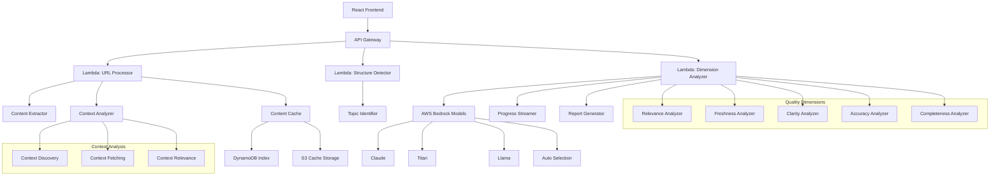
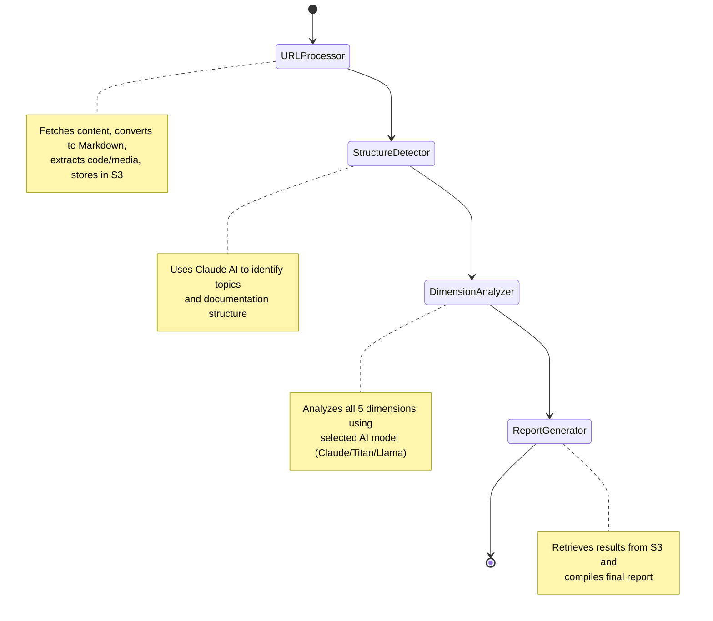
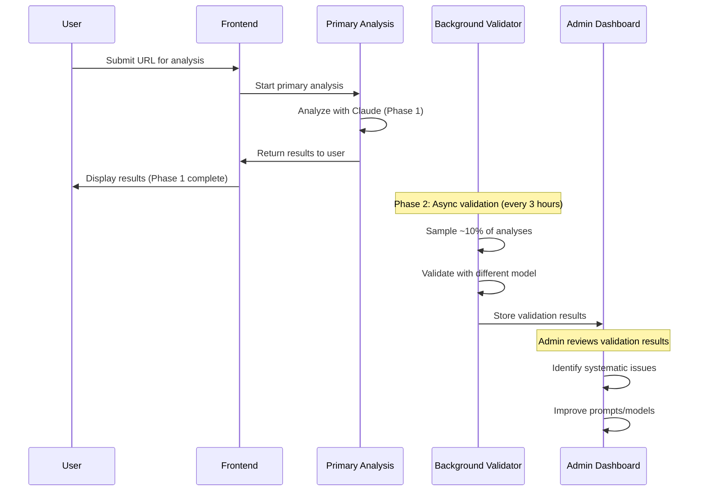

# Design Document: Documentation Quality Auditor

## Overview

Lensy is a web-based documentation quality auditor that analyzes developer documentation URLs and provides comprehensive quality reports. The system uses a React frontend with AWS Lambda backend, leveraging AWS Bedrock's multi-model capabilities for AI-powered analysis. The architecture supports real-time progress streaming, graceful degradation, and configurable model selection.

## Architecture

### High-Level Architecture



### Component Architecture

The system follows a microservices pattern with distinct Lambda functions for each major operation:

1. **Frontend Layer**: React SPA with context analysis UI and real-time WebSocket connections
2. **API Layer**: AWS API Gateway with WebSocket support for streaming
3. **Processing Layer**: Multiple Lambda functions for parallel processing with intelligent caching
4. **AI Layer**: AWS Bedrock integration with model selection logic
5. **Streaming Layer**: WebSocket connections for real-time progress updates
6. **Caching Layer**: DynamoDB index with S3 storage for processed content optimization

### Step Functions Workflow (Current Implementation)



**Key Architecture Decisions:**
- **S3 Storage**: All content and results stored in S3 to avoid Step Functions 256KB data limit
- **Minimal Responses**: Lambda functions return only success/failure status, not full content
- **Sequential Processing**: URL → Structure → Dimensions → Report (4 steps)
- **Quality Validator Removed**: LLM-as-Judge moved to Phase 2 as async background process

**Timeout Handling Strategy:**
- Each dimension analysis = separate Step Function state
- Individual timeouts: 5 minutes per dimension
- Retry logic: 2 attempts per dimension with exponential backoff
- Partial success: Generate report with available dimensions
- State persistence: Resume from last successful checkpoint

```typescript
interface StepFunctionState {
  analysisId: string;
  completedDimensions: string[];
  failedDimensions: string[];
  partialResults: Record<string, DimensionResult>;
  retryCount: Record<string, number>;
}
```

## Components and Interfaces

#### URLInputComponent
- **Purpose**: Handles URL submission and model selection
- **Props**: `onSubmit(url, model)`, `availableModels[]`
- **State**: `url`, `selectedModel`, `isAnalyzing`
- **Interface**: Renders input field, model dropdown, and analyze button

#### StructureConfirmationComponent
- **Purpose**: Displays detected structure for user confirmation
- **Props**: `detectedStructure`, `onConfirm()`, `onEdit()`
- **State**: `isEditing`, `editedStructure`
- **Interface**: Shows topic breakdown with edit capabilities

#### ProgressStreamComponent
- **Purpose**: Real-time progress display with streaming updates
- **Props**: `progressEvents[]`, `isComplete`
- **State**: `events`, `autoScroll`
- **Interface**: Scrollable progress log with status icons

#### QualityDashboardComponent
- **Purpose**: Final results display with scores and recommendations
- **Props**: `analysisResults`, `modelUsed`, `confidence`
- **State**: `expandedDimensions[]`, `filterSettings`, `viewMode`
- **Interface**: Score cards with expandable recommendation details
- **Future Enhancement**: Configurable/filterable report views for substantial content
- **Static Report**: Initial version shows fixed layout, expandable for future customization

### Backend Components

#### URLProcessor (Lambda)
- **Purpose**: Fetches content and creates clean Markdown representation using aggressive noise reduction pipeline
- **Input**: `{ url: string, selectedModel: string, sessionId: string, analysisStartTime: number }`
- **Output**: `{ success: boolean, sessionId: string, message: string }` (content stored in S3)
- **Dependencies**: 
  - `jsdom@^23.0.0` - HTML parsing and DOM manipulation
  - `turndown@^7.1.2` - HTML to Markdown conversion
  - `turndown-plugin-gfm@^1.0.2` - GitHub Flavored Markdown support
- **Processing Strategy**:
  1. **Fetch**: Retrieve raw HTML from URL with User-Agent header
  2. **Parse**: Use JSDOM to create traversable document
  3. **Remove Noise (DOM Level)**: Call `removeNoiseElements()` to remove 40+ types of noise elements
  4. **Extract Main Content**: Use `extractMainContent()` with WordPress-specific selectors
  5. **Convert**: Use Turndown with aggressive `remove()` configuration
  6. **Store**: Save to S3 with noise reduction metrics
- **Noise Reduction Implementation**:
  ```typescript
  // DOM-level removal (before Turndown)
  function removeNoiseElements(document: Document): number {
    const noiseSelectors = [
      // Scripts and styles (CRITICAL!)
      'script', 'style', 'noscript', 'link[rel="stylesheet"]',
      // Navigation and UI chrome
      'nav', 'header', 'footer', 'aside',
      '[role="navigation"]', '[role="banner"]', '[role="contentinfo"]',
      // WordPress.org specific
      '.site-header', '.site-footer', '#wporg-header', '#wporg-footer',
      '.wp-block-wporg-sidebar-container', '.wp-block-social-links',
      // Forms, media, hidden elements
      'form', 'input', 'button', 'textarea', 'iframe', 'embed', 'video', 'audio',
      '[style*="display:none"]', '.hidden', '.sr-only',
      // 30+ more selectors...
    ];
    // Returns count of removed elements for logging
  }
  
  // Content extraction with fallback strategies
  function extractMainContent(document: Document): Element {
    // Strategy 1: WordPress.org specific (.entry-content, .post-content)
    // Strategy 2: Generic containers (main, article, [role="main"])
    // Strategy 3: Fallback to document.body
  }
  ```
- **Turndown Configuration**:
  ```typescript
  function configureTurndownService(): TurndownService {
    const turndown = new TurndownService({
      headingStyle: 'atx',
      codeBlockStyle: 'fenced',
      bulletListMarker: '-'
    });
    
    // Add GFM plugin
    turndown.use(gfm);
    
    // Aggressive removal using built-in remove() method
    turndown.remove([
      'script', 'style', 'noscript', 'link',
      'nav', 'footer', 'header', 'aside',
      'form', 'input', 'button', 'textarea',
      'iframe', 'embed', 'object', 'video', 'audio',
      'meta', 'title', 'base'
    ]);
    
    // Custom rules for WordPress callouts and code blocks
    // ...
  }
  ```
- **Noise Reduction Metrics**:
  ```typescript
  interface NoiseReductionMetrics {
    originalSize: number;      // Raw HTML size (e.g., 176KB)
    cleanedSize: number;        // After noise removal (e.g., 15KB)
    reductionPercent: number;   // Percentage reduced (e.g., 91%)
  }
  ```
- **Logging**: Detailed logs for debugging noise reduction effectiveness
- **Result**: Typically 90-95% size reduction (176KB → 15KB → 5KB markdown)
- **Storage**: Clean content stored in S3 at `sessions/{sessionId}/processed-content.json`
- **Format Support**: Handles various documentation formats including HTML, Markdown-based sites, and API references as specified in Requirements 1.4

#### StructureDetector (Lambda)
- **Purpose**: Analyzes content structure and identifies topics
- **Input**: `{ content: string, metadata: object }`
- **Output**: `{ topics: Topic[], confidence: number }`
- **Logic**: Uses content analysis to detect documentation organization

#### DimensionAnalyzer (Lambda)
- **Purpose**: Orchestrates quality analysis using AWS Step Functions for timeout resilience
- **Input**: `{ content: ProcessedContent, structure: object, model: string }`
- **Output**: Streaming progress events + final report
- **Timeout Handling**: 
  - **Step Functions**: Manages state and retries for long-running analysis
  - **Checkpointing**: Each dimension analysis is a separate state with retry capability
  - **Resume Logic**: Failed dimensions can be retried without reprocessing successful ones
  - **Graceful Degradation**: Partial results available even if some dimensions timeout
- **Architecture Change**: Use Step Functions Express Workflows for sub-15-minute executions with retry
- **Storage**: Temporary state in Step Functions, results streamed via WebSocket

#### ModelSelector
- **Purpose**: Manages AI model selection at the analysis level (not per-dimension)
- **Input**: `{ modelPreference: string, analysisType: 'full' | 'quick' }`
- **Output**: `{ selectedModel: string, modelConfig: object }`
- **Clarification**: 
  - **Single Model Per Analysis**: One model processes ALL dimensions for consistency
  - **Auto Selection**: Chooses best overall model based on content type and analysis requirements
  - **User Override**: Allows manual model selection for experimentation
  - **Model Consistency**: Same model used throughout entire analysis session

```typescript
// Clarified model selection logic
interface ModelSelectionStrategy {
  userPreference: 'claude' | 'titan' | 'llama' | 'auto';
  contentType: 'api-docs' | 'tutorial' | 'reference' | 'mixed';
  analysisDepth: 'quick' | 'comprehensive';
}

function selectModel(strategy: ModelSelectionStrategy): string {
  if (strategy.userPreference !== 'auto') {
    return strategy.userPreference; // User choice overrides everything
  }
  
  // Auto selection based on content type
  switch (strategy.contentType) {
    case 'api-docs': return 'claude';    // Best for technical accuracy
    case 'tutorial': return 'llama';     // Best for readability assessment  
    case 'reference': return 'titan';    // Best for completeness checking
    default: return 'claude';            // Default fallback
  }
}
```

### AI Integration Components

#### PromptBuilder
- **Purpose**: Constructs optimized prompts for different models and dimensions
- **Input**: `{ dimension: string, content: string, model: string }`
- **Output**: `{ prompt: string, parameters: object }`
- **Optimization**: Model-specific prompt formatting and parameter tuning

#### ResponseParser
- **Purpose**: Parses and validates AI model responses
- **Input**: `{ rawResponse: string, expectedFormat: object }`
- **Output**: `{ parsedData: object, confidence: number }`
- **Validation**: JSON structure validation and error recovery

## Data Models

### Core Data Structures

```typescript
interface AnalysisRequest {
  url: string;
  selectedModel: 'claude' | 'titan' | 'llama' | 'auto';
  sessionId: string;
  contextAnalysis?: {
    enabled: boolean;
    maxContextPages?: number;
  };
}

interface ProcessedContent {
  url: string;
  markdownContent: string;
  htmlContent: string; // Cleaned HTML, not raw
  mediaElements: MediaElement[];
  codeSnippets: CodeSnippet[];
  contentType: 'api-docs' | 'tutorial' | 'reference' | 'mixed';
  linkAnalysis: LinkAnalysisSummary;
  contextAnalysis?: ContextAnalysisResult;
  processedAt: string;
  noiseReduction: NoiseReductionMetrics;
}

interface ProcessedContentIndex {
  url: string;                    // Partition key
  processedAt: string;            // Sort key
  contentHash: string;            // Content hash for validation
  s3Location: string;             // S3 path to processed content
  ttl: number;                    // TTL for automatic cleanup
  contentType: string;            // 'api-docs' | 'tutorial' | 'reference'
  noiseReductionMetrics: NoiseReductionMetrics;
  contextAnalysis?: {
    contextPages: ContextPage[];
    analysisScope: string;
  };
}

interface ContextPage {
  url: string;
  title: string;
  relationship: 'parent' | 'child' | 'sibling';
  confidence: number;
  contentHash?: string;
}

interface ContextAnalysisResult {
  contextPages: ContextPage[];
  analysisScope: 'single-page' | 'with-context';
  totalPagesAnalyzed: number;
}

interface NoiseReductionMetrics {
  originalSize: number;
  cleanedSize: number;
  reductionPercent: number;
}

interface MediaElement {
  type: 'video' | 'audio' | 'image' | 'interactive';
  src: string;
  alt?: string;
  caption?: string;
  context: string; // surrounding text for relevance analysis
  analysisNote: string; // how this affects documentation quality
}

interface CodeSnippet {
  language: string;
  code: string;
  lineNumber: number;
  context: string;
  hasVersionInfo: boolean;
}

interface DocumentStructure {
  type: 'single_topic' | 'multi_topic';
  topics: Topic[];
  confidence: number;
  contentType: 'api-docs' | 'tutorial' | 'reference' | 'mixed';
}

interface Topic {
  name: string;
  pageCount: number;
  urls: string[];
}

interface DimensionResult {
  dimension: DimensionType;
  score: number | null;
  status: 'complete' | 'failed' | 'timeout' | 'retrying';
  findings: string[];
  recommendations: Recommendation[];
  failureReason?: string;
  retryCount: number;
  processingTime: number;
}

interface Recommendation {
  priority: 'high' | 'medium' | 'low';
  action: string;
  location?: string;
  impact: string;
  codeExample?: string;
  mediaReference?: string; // Reference to media element if applicable
}

interface ProgressEvent {
  type: 'progress' | 'completion' | 'error' | 'retry';
  dimension?: DimensionType;
  status: 'starting' | 'in_progress' | 'complete' | 'failed' | 'retrying';
  message: string;
  details?: {
    finding?: string;
    severity?: 'info' | 'warning' | 'error';
    lineNumber?: number;
    retryAttempt?: number;
  };
  timestamp: string;
}

interface FinalReport {
  overallScore: number;
  dimensionsAnalyzed: number;
  dimensionsTotal: number;
  confidence: 'high' | 'medium' | 'low';
  modelUsed: string;
  dimensions: Record<DimensionType, DimensionResult>;
  codeAnalysis: CodeAnalysisSummary;
  mediaAnalysis: MediaAnalysisSummary;
  linkAnalysis: LinkAnalysisSummary;
  analysisTime: number;
  retryCount: number;
}

interface CodeAnalysisSummary {
  snippetsFound: number;
  syntaxErrors: number;
  deprecatedMethods: number;
  missingVersionSpecs: number;
  languagesDetected: string[];
}

interface MediaAnalysisSummary {
  videosFound: number;
  audiosFound: number;
  imagesFound: number;
  interactiveElements: number;
  accessibilityIssues: number;
  missingAltText: number;
}

interface LinkAnalysisSummary {
  totalLinks: number;
  internalLinks: number;
  externalLinks: number;
  brokenLinks: number;
  subPagesIdentified: string[];
  linkContext: 'single-page' | 'multi-page-referenced';
  analysisScope: 'current-page-only' | 'with-context';
}

interface CacheMetrics {
  hitRate: number;              // Cache hit percentage
  avgProcessingTime: number;    // Average processing time
  cacheSize: number;            // Current cache entries
  s3StorageUsed: number;        // S3 storage in bytes
  costSavings: number;          // Estimated cost savings from cache hits
}

interface ContextAnalysisStrategy {
  enabled: boolean;
  maxContextPages: number;      // Default: 5
  includeParent: boolean;       // Default: true (immediate parent only)
  includeChildren: boolean;     // Default: true (direct children only)
  includeSiblings: boolean;     // Default: false (too broad by default)
  relevanceThreshold: number;   // Default: 0.6
}
```

### Model Configuration

```typescript
interface ModelConfig {
  name: string;
  provider: 'bedrock';
  modelId: string;
  maxTokens: number;
  temperature: number;
  timeoutMs: number;
  strengths: DimensionType[];
}

const MODEL_CONFIGS: Record<string, ModelConfig> = {
  claude: {
    name: 'Claude 3.5 Sonnet',
    provider: 'bedrock',
    modelId: 'us.anthropic.claude-3-5-sonnet-20241022-v2:0', // Cross-region inference profile
    maxTokens: 2000,
    temperature: 0.1,
    timeoutMs: 30000,
    strengths: ['accuracy', 'clarity', 'relevance', 'freshness', 'completeness'],
    reasoning: 'Excellent at code analysis, technical writing evaluation, and structured reasoning',
    status: '✅ FULLY WORKING'
  }
};

// Phase 2 Model Configurations (Future Enhancement)
const PHASE_2_MODEL_CONFIGS: Record<string, ModelConfig> = {
  titan: {
    name: 'Amazon Titan Text Premier',
    provider: 'bedrock',
    modelId: 'amazon.titan-text-premier-v1:0',
    maxTokens: 2000,
    temperature: 0.1,
    timeoutMs: 30000,
    strengths: ['completeness', 'freshness'],
    reasoning: 'Optimized for information extraction and comprehensive analysis',
    status: '⚠️ PHASE 2 - API format implemented, needs testing'
  },
  llama: {
    name: 'Meta Llama 3.1 70B',
    provider: 'bedrock',
    modelId: 'us.meta.llama3-1-70b-instruct-v1:0', // Cross-region inference profile
    maxTokens: 2000,
    temperature: 0.1,
    timeoutMs: 30000,
    strengths: ['relevance', 'clarity'],
    reasoning: 'Strong context understanding and balanced assessments',
    status: '⚠️ PHASE 2 - API format implemented, response parsing needs debugging'
  }
};
```

Now I need to use the prework tool to analyze the acceptance criteria before writing the correctness properties section.

## Correctness Properties

*A property is a characteristic or behavior that should hold true across all valid executions of a system—essentially, a formal statement about what the system should do. Properties serve as the bridge between human-readable specifications and machine-verifiable correctness guarantees.*

### Property 1: URL Processing Reliability
*For any* valid documentation URL, the system should successfully fetch and extract content, and for any invalid URL, the system should return a descriptive error message without crashing.
**Validates: Requirements 1.1, 1.2**

### Property 2: Noise Reduction Effectiveness
*For any* HTML content processed, the system should achieve at least 90% noise reduction by removing scripts, styles, navigation, headers, footers, forms, and media embeds while preserving main documentation content.
**Validates: Requirements 1.5, 1.6, 1.7, 1.8, 1.9, 1.10**

### Property 3: Content Structure Detection
*For any* extracted documentation content, the system should identify the structure and topics, and require explicit user confirmation before proceeding to analysis.
**Validates: Requirements 1.3, 2.1, 2.2, 2.3**

### Property 4: Progress Streaming Completeness
*For any* dimension analysis session, the progress streamer should emit status updates for each phase, report specific findings as they occur, and mark completion or failure with appropriate details.
**Validates: Requirements 3.1, 3.2, 3.4, 3.5**

### Property 5: Code Validation Thoroughness
*For any* code snippet found in documentation, the code validator should detect the programming language, check syntax errors with line numbers, identify deprecated methods, and flag missing version specifications.
**Validates: Requirements 3.3, 5.1, 5.2, 5.3, 5.4, 5.5**

### Property 6: Dimension Analysis Isolation
*For any* set of quality dimensions being analyzed, if one dimension fails, the remaining dimensions should continue processing and complete successfully.
**Validates: Requirements 4.7, 6.3**

### Property 7: Graceful Degradation Behavior
*For any* analysis session where some dimensions fail, the system should display results for successful dimensions, clearly mark failed ones with reasons, and never show empty dashboards or undefined scores.
**Validates: Requirements 6.1, 6.3, 6.4, 6.5**

### Property 8: Report Generation Accuracy
*For any* completed analysis, the report generator should calculate overall scores only from successful dimensions, provide specific actionable recommendations, and prioritize them by impact level.
**Validates: Requirements 7.1, 7.2, 7.3, 7.5**

### Property 9: Model Selection Consistency
*For any* selected AI model, the system should use that model consistently across all dimensions, and when "Auto" is selected, should choose appropriate models for each dimension type.
**Validates: Requirements 9.3, 9.4, 9.5**

### Property 10: Timeout Handling
*For any* dimension analysis that exceeds the 30-second timeout, the system should gracefully terminate that dimension and continue with others, showing partial results.
**Validates: Requirements 6.4, 13.3**

### Property 11: API Response Structure
*For any* API response from the system, the response should follow the defined JSON structure and include all required fields for the response type.
**Validates: Requirements 13.5**

### Property 12: Context Analysis Completeness
*For any* context-aware analysis session, the system should correctly identify immediate parent and direct children pages, process them individually with caching, and improve analysis quality compared to single-page analysis.
**Validates: Requirements 10.1, 10.6, 10.10**

### Property 13: Cache Consistency and Performance
*For any* documentation URL, when processed content is cached, subsequent requests should return identical results from cache, and when content changes, the cache should be invalidated and updated with fresh processing.
**Validates: Requirements 11.2, 11.3, 11.7**

### Property 14: Modern UI Responsiveness
*For any* user interface interaction, the system should provide smooth animations, proper visual hierarchy, and responsive design that works across desktop, tablet, and mobile devices.
**Validates: Requirements 12.1, 12.2, 12.3, 12.6**

### Property 16: Content Type Detection Accuracy
*For any* documentation URL processed, the system should correctly identify the content type based on URL patterns, content structure, and textual indicators, and when uncertain, should default to 'mixed' type.
**Validates: Requirements 16.1, 16.2, 16.8**

### Property 17: Adaptive Scoring Fairness
*For any* documentation content, when scoring criteria are not applicable to the detected content type, the system should mark them as not-applicable and redistribute weights to applicable criteria, ensuring no document type is unfairly penalized.
**Validates: Requirements 16.3, 16.4, 16.5**

### Property 15: AWS Integration Scalability
*For any* analysis request load, the system should handle varying loads efficiently using AWS Lambda scaling, maintain 30-second timeouts per dimension, and return structured JSON responses consistently.
**Validates: Requirements 13.1, 13.2, 13.3, 13.5**

### Property 16: Smart Content Type Detection Efficiency
*For any* documentation URL processed, the system should first attempt keyword-based detection, and only use AI fallback when keywords are insufficient, achieving 90% keyword detection rate and minimal AI costs.
**Validates: Requirements 16.1, 16.3, 16.4**

### Property 17: Adaptive Scoring Fairness
*For any* documentation content, when scoring criteria are not applicable to the detected content type, the system should mark them as not-applicable and redistribute weights to applicable criteria, ensuring no document type is unfairly penalized.
**Validates: Requirements 16.5, 16.6, 16.7**

### Property 18: Scoring Transparency and Cost Efficiency
*For any* completed analysis, the system should provide clear explanations of which scoring criteria were applied and which were skipped, while minimizing AI costs through smart detection caching.
**Validates: Requirements 16.7, 16.8, 16.9**

## Phase 1 vs Phase 2 Feature Separation

### Phase 1 Features (Current Implementation)
The core documentation quality auditor with the following capabilities:
- **Single Model Support**: Claude 3.5 Sonnet only
- **Core Analysis**: All 5 quality dimensions (Relevance, Freshness, Clarity, Accuracy, Completeness)
- **Context-Aware Analysis**: Parent/child page discovery and analysis
- **Intelligent Caching**: DynamoDB index with S3 storage and TTL management
- **Modern UI**: React frontend with Material-UI components
- **AWS Integration**: Lambda functions, Step Functions, API Gateway, Bedrock
- **Graceful Degradation**: Partial results when some dimensions fail
- **Real-time Progress**: Polling-based status updates (WebSocket deferred to Phase 2)

### Phase 2 Features (Future Enhancements)
Extended capabilities planned for future releases:
- **Multi-Model Support**: Amazon Titan Text Premier and Meta Llama 3.1 70B
- **LLM-as-Judge Validation**: Async background quality validation using different models
- **Advanced WebSocket Streaming**: Real-time progress updates via WebSocket connections
- **Enhanced Observability**: Comprehensive transparency dashboard and model comparison views
- **Admin Quality Dashboard**: System-wide quality metrics and validation results monitoring

This separation allows for incremental development while maintaining a stable core system in Phase 1.

## Error Handling

### Error Categories and Responses

1. **URL Processing Errors**
   - Invalid URL format: Return structured error with suggestion
   - Network timeout: Retry with exponential backoff, then graceful failure
   - Access denied: Clear error message about permissions
   - Content too large: Truncate with warning about partial analysis

2. **AI Model Errors**
   - Model unavailable: Fallback to alternative model with notification
   - Rate limiting: Queue request with estimated wait time
   - Response parsing failure: Retry with simplified prompt
   - Timeout: Mark dimension as failed, continue with others

3. **Analysis Errors**
   - Code parsing failure: Skip problematic snippets, continue analysis
   - Structure detection failure: Provide manual structure input option
   - Partial dimension failure: Show available results with confidence indicators

### Error Recovery Strategies

```typescript
interface ErrorRecoveryConfig {
  maxRetries: number;
  backoffMultiplier: number;
  fallbackModels: string[];
  gracefulDegradation: boolean;
}

const ERROR_RECOVERY: Record<string, ErrorRecoveryConfig> = {
  urlFetch: {
    maxRetries: 3,
    backoffMultiplier: 2,
    fallbackModels: [],
    gracefulDegradation: true
  },
  modelInvocation: {
    maxRetries: 2,
    backoffMultiplier: 1.5,
    fallbackModels: ['claude', 'titan'],
    gracefulDegradation: true
  }
};
```

## Phase 2: Transparency, Observability, and Quality Evaluation

**Note: This entire section represents Phase 2 functionality and is not part of the initial implementation.**

### LLM-as-Judge Quality Validation (Phase 2 Only)

The system will implement a multi-layered quality assurance approach in Phase 2 to ensure audit reliability through async background validation:

#### 1. **Async Dual Model Validation (LLM-as-Judge)**
```typescript
interface QualityValidation {
  primaryAnalysis: DimensionResult;
  validationAnalysis: DimensionResult;
  consensusScore: number;
  disagreementAreas: string[];
  confidenceLevel: 'high' | 'medium' | 'low';
  validationModel: string;
}

// Phase 2: Async validation workflow (not real-time)
async function validateAnalysisQualityAsync(
  primaryResult: DimensionResult,
  content: ProcessedContent,
  primaryModel: string
): Promise<QualityValidation> {
  // Use different model for validation
  const validationModel = getValidationModel(primaryModel);
  
  const validationResult = await analyzeWithModel(content, validationModel);
  
  return {
    primaryAnalysis: primaryResult,
    validationAnalysis: validationResult,
    consensusScore: calculateConsensus(primaryResult, validationResult),
    disagreementAreas: identifyDisagreements(primaryResult, validationResult),
    confidenceLevel: determineConfidence(primaryResult, validationResult),
    validationModel
  };
}
```

#### 2. **Admin-Only Transparency Dashboard (Phase 2)**
```typescript
interface TransparencyReport {
  modelDecisions: ModelDecisionLog[];
  promptsUsed: PromptLog[];
  processingSteps: ProcessingStep[];
  confidenceMetrics: ConfidenceMetrics;
  validationResults: QualityValidation[];
}

interface ModelDecisionLog {
  timestamp: string;
  decision: string;
  reasoning: string;
  confidence: number;
  inputTokens: number;
  outputTokens: number;
  processingTime: number;
}

interface PromptLog {
  dimension: DimensionType;
  promptTemplate: string;
  actualPrompt: string; // With content substituted
  modelResponse: string;
  parseSuccess: boolean;
}
```

#### 3. **Background Quality Monitoring (Phase 2)**
```typescript
interface ObservabilityMetrics {
  analysisId: string;
  startTime: string;
  currentStep: string;
  dimensionProgress: Record<DimensionType, DimensionProgress>;
  modelPerformance: ModelPerformanceMetrics;
  errorRate: number;
  retryCount: number;
  resourceUsage: ResourceUsage;
}

interface DimensionProgress {
  status: 'pending' | 'processing' | 'validating' | 'complete' | 'failed';
  startTime: string;
  endTime?: string;
  tokensUsed: number;
  confidence: number;
  validationStatus: 'pending' | 'passed' | 'failed' | 'disputed';
}

interface ModelPerformanceMetrics {
  responseTime: number;
  tokenEfficiency: number;
  parseSuccessRate: number;
  consistencyScore: number; // Compared to validation model
}
```

### Phase 2 Quality Assurance Components

#### QualityValidator (Lambda) - Phase 2 Background Process

**Implementation Strategy**: 
- **Async Background Job**: Runs every 3 hours to validate ~10% of completed analyses
- **Admin Dashboard Only**: Results visible to system administrators, not end users
- **System Quality Monitoring**: Used to improve prompts, model selection, and analysis quality
- **No User-Facing Conflicts**: Never shows conflicting scores to end users

**Purpose**: Validates primary analysis using different model for cross-verification
**Scope**: System quality assurance and monitoring, not real-time user-facing validation

#### TransparencyLogger (Phase 2)
- **Purpose**: Logs all model decisions, prompts, and reasoning for audit trail
- **Storage**: CloudWatch Logs with structured JSON for queryability
- **Admin Access**: Transparency data available to administrators for system improvement
- **Retention**: 30-day retention for analysis and debugging

#### ObservabilityDashboard (Phase 2 Admin Component)
- **Purpose**: Admin monitoring of analysis quality and system performance
- **Features**:
  - Live model performance metrics
  - Confidence score tracking across analyses
  - Disagreement alerts between models
  - Token usage and cost tracking
  - Error rate monitoring
- **Access**: Administrator-only interface

### Phase 2 Quality Evaluation Workflow



### Phase 2 Confidence Scoring Algorithm

```typescript
function calculateConfidenceScore(
  primaryResult: DimensionResult,
  validationResult: DimensionResult
): number {
  const scoreDifference = Math.abs(primaryResult.score - validationResult.score);
  const recommendationSimilarity = calculateRecommendationSimilarity(
    primaryResult.recommendations,
    validationResult.recommendations
  );
  
  // Confidence decreases with score disagreement and recommendation differences
  const scoreConfidence = Math.max(0, 1 - (scoreDifference / 10));
  const recommendationConfidence = recommendationSimilarity;
  
  return (scoreConfidence + recommendationConfidence) / 2;
}

function determineValidationAction(confidence: number): 'accept' | 'retry' | 'flag' {
  if (confidence >= 0.8) return 'accept';
  if (confidence >= 0.6) return 'retry';
  return 'flag'; // Human review required
}
```

### Phase 2 User-Facing Transparency Features

#### 1. **Confidence Indicators (Phase 2)**dicators**
- Visual confidence meters for each dimension
- Explanation of why confidence is high/medium/low
- Model agreement/disagreement indicators

#### 2. **"Show Your Work" Feature**
```typescript
interface ExplainabilityData {
  dimension: DimensionType;
  keyFactors: string[];
  evidenceUsed: string[];
  modelReasoning: string;
  alternativeInterpretation?: string; // From validation model
  confidenceFactors: string[];
}
```

#### 3. **Model Comparison View**
- Side-by-side comparison of primary vs validation analysis
- Highlight areas of agreement and disagreement
- Allow users to see which model they trust more for specific dimensions

### Quality Metrics Dashboard

```typescript
interface QualityMetrics {
  overallSystemConfidence: number;
  modelAgreementRate: number;
  averageAnalysisTime: number;
  errorRate: number;
  userSatisfactionScore?: number; // Future: user feedback
  costPerAnalysis: number;
  
  // Dimension-specific metrics
  dimensionReliability: Record<DimensionType, {
    averageConfidence: number;
    modelAgreementRate: number;
    userAcceptanceRate: number;
  }>;
}
```

This comprehensive quality assurance system ensures that:
1. **Every analysis is validated** by a second model
2. **All decisions are transparent** and auditable
3. **Confidence levels are quantified** and communicated
4. **System performance is monitored** in real-time
5. **Users can inspect the reasoning** behind every recommendation

## Context-Aware Analysis Architecture

### Context Discovery and Caching Strategy

The system implements intelligent context analysis with selective page inclusion and comprehensive caching to avoid re-processing content.

#### Context Discovery Logic

```typescript
interface ContextPage {
  url: string;
  title: string;
  relationship: 'parent' | 'child' | 'sibling';
  confidence: number;
  contentHash?: string; // For cache validation
}

interface ContextAnalysisStrategy {
  enabled: boolean;
  maxContextPages: number; // Default: 5
  includeParent: boolean;   // Default: true (immediate parent only)
  includeChildren: boolean; // Default: true (direct children only)
  includeSiblings: boolean; // Default: false (too broad by default)
  relevanceThreshold: number; // Default: 0.6
}

// Selective context inclusion - avoid rabbit holes
function discoverContextPages(
  document: Document, 
  baseUrl: string, 
  strategy: ContextAnalysisStrategy
): ContextPage[] {
  const contextPages: ContextPage[] = [];
  
  // Strategy 1: Immediate parent (1 level up)
  if (strategy.includeParent) {
    const parentPage = findImmediateParent(baseUrl);
    if (parentPage) contextPages.push(parentPage);
  }
  
  // Strategy 2: Direct children (linked from current page)
  if (strategy.includeChildren) {
    const childPages = findDirectChildren(document, baseUrl);
    contextPages.push(...childPages.slice(0, 3)); // Max 3 children
  }
  
  // Strategy 3: Siblings (same parent, different endpoint) - SELECTIVE
  if (strategy.includeSiblings) {
    const siblingPages = findSiblingPages(document, baseUrl);
    contextPages.push(...siblingPages.slice(0, 2)); // Max 2 siblings
  }
  
  return contextPages
    .filter(page => page.confidence >= strategy.relevanceThreshold)
    .slice(0, strategy.maxContextPages);
}
```

#### DynamoDB Caching Layer

```typescript
interface ProcessedContentIndex {
  url: string;                    // Partition key
  contentHash: string;            // Content hash for validation
  s3Location: string;             // S3 path to processed content
  processedAt: string;            // ISO timestamp
  ttl: number;                    // TTL for automatic cleanup
  contentType: string;            // 'api-docs' | 'tutorial' | 'reference'
  noiseReductionMetrics: {
    originalSize: number;
    cleanedSize: number;
    reductionPercent: number;
  };
  contextAnalysis?: {
    contextPages: ContextPage[];
    analysisScope: string;
  };
}

// Cache check workflow
async function processUrlWithCache(
  url: string, 
  contextAnalysis: ContextAnalysisStrategy
): Promise<ProcessedContent> {
  
  // 1. Check DynamoDB index for existing processed content
  const cacheEntry = await checkProcessedContentCache(url);
  
  if (cacheEntry && !isCacheExpired(cacheEntry)) {
    console.log(`Cache hit for ${url}, retrieving from S3`);
    
    // 2. Retrieve processed content from S3
    const cachedContent = await retrieveFromS3(cacheEntry.s3Location);
    
    // 3. Validate content hash (optional integrity check)
    const currentHash = await calculateContentHash(url);
    if (currentHash === cacheEntry.contentHash) {
      return cachedContent;
    } else {
      console.log(`Content changed for ${url}, re-processing`);
    }
  }
  
  // 4. Process content fresh (cache miss or expired/invalid)
  const processedContent = await processContentFresh(url, contextAnalysis);
  
  // 5. Store in cache (DynamoDB + S3)
  await storeInCache(url, processedContent);
  
  return processedContent;
}
```

#### Cache Management

```typescript
interface CacheConfig {
  ttlDays: number;              // Default: 7 days
  maxCacheSize: number;         // Max entries in DynamoDB
  s3BucketName: string;         // S3 bucket for processed content
  compressionEnabled: boolean;   // Gzip compression for S3 storage
}

// DynamoDB Table Schema
const ProcessedContentTable = {
  TableName: 'LensyProcessedContent',
  KeySchema: [
    { AttributeName: 'url', KeyType: 'HASH' }  // Partition key
  ],
  AttributeDefinitions: [
    { AttributeName: 'url', AttributeType: 'S' },
    { AttributeName: 'processedAt', AttributeType: 'S' }
  ],
  GlobalSecondaryIndexes: [
    {
      IndexName: 'ProcessedAtIndex',
      KeySchema: [
        { AttributeName: 'processedAt', KeyType: 'HASH' }
      ],
      Projection: { ProjectionType: 'ALL' }
    }
  ],
  TimeToLiveSpecification: {
    AttributeName: 'ttl',
    Enabled: true
  }
};
```

### Context Analysis Integration

#### Enhanced URLProcessor with Caching

```typescript
// Updated URLProcessor workflow
export const handler: Handler<URLProcessorEvent, URLProcessorResponse> = async (event) => {
  try {
    // 1. Check cache first
    const cachedContent = await checkProcessedContentCache(event.url);
    
    if (cachedContent && !isCacheExpired(cachedContent)) {
      console.log('Using cached content');
      return {
        success: true,
        sessionId: event.sessionId,
        message: 'Retrieved from cache',
        fromCache: true
      };
    }
    
    // 2. Process content fresh
    const processedContent = await processContentWithContext(event);
    
    // 3. Store in cache
    await storeProcessedContent(event.url, processedContent);
    
    return {
      success: true,
      sessionId: event.sessionId,
      message: 'Content processed and cached'
    };
    
  } catch (error) {
    console.error('URL processing failed:', error);
    return {
      success: false,
      sessionId: event.sessionId,
      message: error instanceof Error ? error.message : 'Unknown error'
    };
  }
};

async function processContentWithContext(event: URLProcessorEvent): Promise<ProcessedContent> {
  // Process main content
  const mainContent = await processMainContent(event.url);
  
  // Process context pages if enabled
  let contextContent: ProcessedContent[] = [];
  
  if (event.contextAnalysis?.enabled) {
    const contextPages = discoverContextPages(
      mainContent.document, 
      event.url,
      {
        enabled: true,
        maxContextPages: event.contextAnalysis.maxContextPages || 5,
        includeParent: true,
        includeChildren: true,
        includeSiblings: false, // Selective by default
        relevanceThreshold: 0.6
      }
    );
    
    // Process context pages (with their own cache checks)
    for (const contextPage of contextPages) {
      try {
        const contextProcessed = await processUrlWithCache(
          contextPage.url,
          { enabled: false } // Don't recurse context analysis
        );
        contextContent.push(contextProcessed);
      } catch (error) {
        console.log(`Failed to process context page ${contextPage.url}:`, error);
        // Continue with other context pages
      }
    }
  }
  
  return {
    ...mainContent,
    contextAnalysis: {
      contextPages: contextContent.map(c => ({
        url: c.url,
        title: c.title || 'Context Page',
        relationship: determineRelationship(c.url, event.url),
        confidence: 0.8
      })),
      analysisScope: contextContent.length > 0 ? 'with-context' : 'single-page',
      totalPagesAnalyzed: 1 + contextContent.length
    }
  };
}
```

### Performance and Cost Optimization

#### Smart Detection Strategy
- **Layer 1 (90% of cases)**: Keyword matching on URL and title (free, <5ms)
- **Layer 2 (10% of cases)**: AI classification using metadata (~50 tokens, $0.0001)
- **Caching**: AI results stored in DynamoDB, never re-computed
- **Cost**: ~$0.01 per 1000 URLs analyzed

#### Detection Accuracy
- **High confidence**: URL patterns and function signatures
- **Medium confidence**: AI classification of unclear cases
- **Fallback**: 'mixed' type uses balanced scoring criteria

#### Parallel Context Processing

```typescript
// Process context pages in parallel for better performance
async function processContextPagesParallel(
  contextPages: ContextPage[]
): Promise<ProcessedContent[]> {
  const contextPromises = contextPages.map(async (page) => {
    try {
      return await processUrlWithCache(page.url, { enabled: false });
    } catch (error) {
      console.log(`Context page failed: ${page.url}`, error);
      return null;
    }
  });
  
  const results = await Promise.allSettled(contextPromises);
  
  return results
    .filter((result): result is PromiseFulfilledResult<ProcessedContent> => 
      result.status === 'fulfilled' && result.value !== null
    )
    .map(result => result.value);
}
```

#### Cache Warming Strategy

```typescript
// Optional: Pre-warm cache for popular documentation sites
interface CacheWarmingConfig {
  enabled: boolean;
  popularUrls: string[];
  warmingSchedule: string; // Cron expression
}

async function warmCache(config: CacheWarmingConfig): Promise<void> {
  if (!config.enabled) return;
  
  for (const url of config.popularUrls) {
    try {
      await processUrlWithCache(url, { enabled: true });
      console.log(`Cache warmed for ${url}`);
    } catch (error) {
      console.log(`Cache warming failed for ${url}:`, error);
    }
  }
}
```

### Monitoring and Observability

#### Cache Performance Metrics

```typescript
interface CacheMetrics {
  hitRate: number;              // Cache hit percentage
  avgProcessingTime: number;    // Average processing time
  cacheSize: number;            // Current cache entries
  s3StorageUsed: number;        // S3 storage in bytes
  costSavings: number;          // Estimated cost savings from cache hits
}

// CloudWatch metrics for cache performance
async function publishCacheMetrics(metrics: CacheMetrics): Promise<void> {
  await cloudWatch.putMetricData({
    Namespace: 'Lensy/Cache',
    MetricData: [
      {
        MetricName: 'CacheHitRate',
        Value: metrics.hitRate,
        Unit: 'Percent'
      },
      {
        MetricName: 'ProcessingTime',
        Value: metrics.avgProcessingTime,
        Unit: 'Milliseconds'
      }
    ]
  }).promise();
}
```

## Future AI Agent Architecture

The current design is architected to support future expansion into an AI agent system that handles:

1. **Content Creation**: Generate documentation based on analysis findings
2. **Content Review**: Current audit functionality with context awareness
3. **Content Publishing**: Automated publishing workflows
4. **Content Maintenance**: Automated updates based on cache invalidation

### Agent-Ready Design Patterns

```typescript
interface AgentAction {
  type: 'analyze' | 'generate' | 'publish' | 'review' | 'maintain';
  input: any;
  context: AgentContext;
}

interface AgentContext {
  previousActions: AgentAction[];
  userPreferences: UserPreferences;
  projectContext: ProjectContext;
  cacheContext: CacheContext;
}

// Future agent orchestrator with caching awareness
class DocumentationAgent {
  async executeAction(action: AgentAction): Promise<AgentResult> {
    switch (action.type) {
      case 'analyze': return this.contextAwareAnalysisFlow(action);
      case 'generate': return this.futureGenerationFlow(action);
      case 'publish': return this.futurePublishingFlow(action);
      case 'maintain': return this.cacheMaintenanceFlow(action);
    }
  }
}
```

### Migration Strategy

The current architecture can be extended without breaking changes:
- **Phase 1**: Context-aware audit system with DynamoDB caching (current implementation)
- **Phase 2**: Add content generation capabilities with cache-aware workflows
- **Phase 3**: Add publishing workflows with cache invalidation
- **Phase 4**: Full AI agent with proactive cache management agent orchestration

This modular approach allows incremental development while maintaining the core audit functionality.

## Model Selection Rationale

### Phase 1: Claude-Only Implementation

For the initial implementation, the system uses only Claude 3.5 Sonnet based on:

**Claude 3.5 Sonnet Advantages:**
- **Superior Code Analysis**: Excellent at detecting syntax errors, deprecated methods, and version compatibility issues
- **Technical Writing Evaluation**: Strong performance on documentation clarity and accuracy assessment
- **Structured Reasoning**: Reliable JSON response formatting and consistent scoring methodology
- **Proven Performance**: [Anthropic documentation](https://docs.anthropic.com) demonstrates excellent technical content analysis capabilities

**Single Model Strategy Benefits:**
- **Consistency**: All dimensions analyzed with the same model for coherent scoring
- **Reliability**: Proven working implementation with stable JSON parsing
- **Simplicity**: Reduced complexity for initial deployment and testing
- **Cost Efficiency**: Single model reduces token usage and API costs

### Phase 2: Multi-Model Support

Future expansion will include additional models based on AWS Bedrock capabilities:

**Amazon Titan Text Premier** (Phase 2):
- **Strengths**: Information extraction, summarization, comprehensive analysis
- **Use Cases**: Completeness and Freshness dimensions
- **Evidence**: [AWS documentation](https://aws.amazon.com/bedrock/titan/) highlights optimization for text analysis tasks

**Meta Llama 3.1 70B** (Phase 2):
- **Strengths**: Context understanding, balanced assessments
- **Use Cases**: Relevance dimension, general content evaluation
- **Evidence**: Strong performance on reasoning tasks per [AWS Bedrock model comparison](https://aws.amazon.com/bedrock/llama/)

### Phase 1 Model Selection Logic
```typescript
// Simplified: Claude-only for Phase 1 reliability
function selectModelForAnalysis(contentType: string, userPreference: string): string {
  // Phase 1: Always use Claude regardless of preference
  return 'claude';
}

// Phase 2: Full auto-selection logic (future)
const PHASE_2_AUTO_MODEL_SELECTION = {
  'api-docs': 'claude',              // Technical documentation - best code analysis
  'tutorial': 'llama',               // Educational content - balanced assessment
  'reference': 'titan',              // Reference material - comprehensive analysis
  'mixed': 'claude'                  // Default for mixed content types
};
```

**Migration Strategy:**
- Phase 1: Establish reliable Claude-based analysis pipeline
- Phase 2: Add Titan and Llama with proper response parsing and validation
- Phase 3: Enable intelligent auto-selection based on content type and user preferences

## Content-Type-Aware Scoring Framework

### Problem: One-Size-Fits-All Scoring Doesn't Work

Different documentation types have different quality expectations:

| Doc Type | Code Expected? | What Matters Most |
|----------|---------------|-------------------|
| API Reference | ✅ Yes, lots | Syntax accuracy, complete examples |
| Tutorial | ✅ Yes | Step-by-step flow, runnable code |
| Conceptual Guide | ❌ No | Clear explanations, diagrams |
| Overview | ❌ No | Navigation, scope definition |
| Troubleshooting | ❌ Maybe | Problem coverage, solutions |

### Solution: Adaptive Scoring Based on Document Type

#### Smart Content Type Detection: Keyword-First + AI-Fallback

```typescript
type DocumentationType = 
  | 'api-reference'      // Function/class docs, needs code
  | 'tutorial'           // Step-by-step guide, needs code
  | 'conceptual'         // Explains concepts, may not need code
  | 'how-to'             // Task-focused, usually needs code
  | 'reference'          // Tables, lists, specs
  | 'troubleshooting'    // Problem/solution format
  | 'overview'           // High-level intro, rarely needs code
  | 'changelog'          // Version history
  | 'mixed';             // Combination

// Layer 1: Fast keyword matching (90% of cases, free)
function detectByKeywords(url: string, title: string): DocumentationType | null {
    const urlLower = url.toLowerCase();
    const titleLower = title.toLowerCase();
    const searchText = `${urlLower} ${titleLower}`;
    
    // High-confidence keyword matches
    if (searchText.includes('/reference/functions/') || 
        searchText.includes('/reference/classes/') ||
        titleLower.includes('()') || 
        titleLower.includes('function')) {
        return 'api-reference';
    }
    
    if (searchText.includes('getting-started') || 
        searchText.includes('tutorial') ||
        titleLower.includes('tutorial')) {
        return 'tutorial';
    }
    
    if (searchText.includes('/explanations/') || 
        searchText.includes('architecture') ||
        titleLower.includes('architecture') ||
        titleLower.includes('understanding')) {
        return 'conceptual';
    }
    
    if (searchText.includes('how-to') || 
        titleLower.includes('how to') ||
        titleLower.includes('create') ||
        titleLower.includes('build')) {
        return 'how-to';
    }
    
    if (searchText.includes('/intro') || 
        searchText.includes('introduction') ||
        titleLower.includes('introduction')) {
        return 'overview';
    }
    
    if (searchText.includes('/reference-guides/') ||
        titleLower.includes('reference')) {
        return 'reference';
    }
    
    return null; // No clear match - need AI fallback
}

// Layer 2: AI fallback for unclear cases (10% of cases, small cost)
async function detectByAI(url: string, title: string, description?: string): Promise<DocumentationType> {
    const prompt = `Classify this documentation page type:

URL: ${url}
Title: ${title}
Description: ${description || 'N/A'}

Classify as ONE of: api-reference, tutorial, conceptual, how-to, overview, reference, troubleshooting, mixed

Respond with just the type name.`;

    const response = await callBedrockModel(prompt);
    return response.trim() as DocumentationType;
}

// Complete detection with caching
async function detectContentTypeEnhanced(
    document: Document, 
    markdownContent: string, 
    url: string
): Promise<DocumentationType> {
    
    // Layer 1: Fast keyword detection (90% of cases)
    const keywordType = detectByKeywords(url, document.title);
    if (keywordType) {
        console.log(`✅ Detected by keywords: ${keywordType}`);
        return keywordType;
    }
    
    // Layer 2: AI fallback for unclear cases (10% of cases)
    console.log(`🤖 Using AI fallback for: ${url}`);
    
    const metaDescription = document.querySelector('meta[name="description"]')?.getAttribute('content');
    const aiType = await detectByAI(url, document.title, metaDescription);
    
    console.log(`🎯 AI detected: ${aiType}`);
    return aiType;
}
```

#### Type-Specific Scoring Rubrics

```typescript
interface AdaptiveCriteria {
  criterion: string;
  applicability: Record<DocumentationType, 'required' | 'optional' | 'not-applicable'>;
  weight: Record<DocumentationType, number>;
}

const codeExamplesCriteria: AdaptiveCriteria = {
  criterion: 'Code Examples Quality',
  applicability: {
    'api-reference': 'required',
    'tutorial': 'required',
    'how-to': 'required',
    'conceptual': 'optional',      // Nice to have, not required
    'overview': 'not-applicable',  // Don't penalize for no code
    'changelog': 'not-applicable',
    'troubleshooting': 'optional',
    'reference': 'optional',
    'mixed': 'optional'
  },
  weight: {
    'api-reference': 30,  // Heavy weight - code is critical
    'tutorial': 25,
    'how-to': 25,
    'conceptual': 10,     // Light weight - code is bonus
    'overview': 0,        // Zero weight - don't count
    'changelog': 0,
    'troubleshooting': 15,
    'reference': 10,
    'mixed': 15
  }
};
```

#### Graceful Handling of Non-Applicable Criteria

```typescript
function calculateDimensionScore(results: CriterionResult[]): number {
  // Filter out not-applicable criteria
  const applicableResults = results.filter(r => r.status === 'evaluated');
  
  // Redistribute weights among applicable criteria
  const totalOriginalWeight = applicableResults.reduce((sum, r) => sum + r.weight, 0);
  
  applicableResults.forEach(r => {
    r.adjustedWeight = (r.weight / totalOriginalWeight) * 100;
  });
  
  // Calculate weighted score
  const weightedScore = applicableResults.reduce(
    (sum, r) => sum + (r.score! * r.adjustedWeight / 100), 
    0
  );
  
  return Math.round(weightedScore);
}
```

### Example: Fair Scoring Across Document Types

**Conceptual Guide**: "Understanding WordPress Block Architecture"
- **Without Adaptive Scoring**: 64/100 (penalized for no code examples)
- **With Adaptive Scoring**: 86/100 (code examples marked N/A, weights redistributed)

**API Reference**: "wp_insert_post() Function"
- **Code Examples Weight**: 30% (critical for API docs)
- **Explanation Weight**: 20% (less critical than examples)

**Overview Page**: "WordPress Developer Resources"
- **Code Examples Weight**: 0% (not applicable)
- **Navigation Weight**: 40% (critical for overview pages)

## Testing Strategy

### Dual Testing Approach

The system requires both unit testing and property-based testing for comprehensive coverage:
- Specific examples of URL processing with known inputs/outputs
- Edge cases like malformed URLs, empty content, timeout scenarios
- Integration points between frontend and backend components
- Error conditions and recovery mechanisms

**Property-Based Tests** focus on:
- Universal properties that hold across all valid inputs
- Comprehensive input coverage through randomization
- System behavior under various load and failure conditions
- Cross-model consistency and performance characteristics

### Property-Based Testing Configuration

- **Testing Framework**: Use fast-check for JavaScript/TypeScript property testing
- **Test Iterations**: Minimum 100 iterations per property test
- **Test Tagging**: Each property test references its design document property
- **Tag Format**: `Feature: documentation-quality-auditor, Property {number}: {property_text}`

### Test Data Generation

```typescript
// Example generators for property testing
const urlGenerator = fc.webUrl();
const documentContentGenerator = fc.record({
  html: fc.string(),
  codeSnippets: fc.array(fc.record({
    language: fc.constantFrom('javascript', 'python', 'java'),
    code: fc.string(),
    hasErrors: fc.boolean()
  })),
  links: fc.array(fc.webUrl())
});

const modelSelectionGenerator = fc.constantFrom('claude', 'titan', 'llama', 'auto');
```

### Integration Testing

- **End-to-End Flows**: Test complete analysis workflows with real documentation URLs
- **Model Comparison**: Verify consistent behavior across different AI models
- **Performance Testing**: Ensure analysis completes within acceptable timeframes
- **Failure Simulation**: Test graceful degradation under various failure conditions

### Test Environment Setup

- **Mock AWS Services**: Use LocalStack for local AWS service simulation
- **Test Documentation**: Maintain test documentation URLs with known characteristics
- **Automated Testing**: CI/CD pipeline with automated test execution
- **Performance Monitoring**: Track analysis times and success rates across test runs