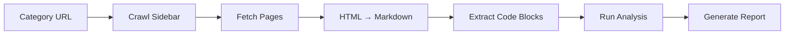

# Lensy MVP Spec

## Goal
Analyze WordPress developer documentation by category (e.g., Hooks, Security) to find code issues, coverage gaps, and redundancy.

## Architecture



## Stack
- Node.js + TypeScript
- Turndown (HTML→MD)
- JSDOM (parsing)
- AWS Bedrock (Claude) for LLM analysis
- React frontend

## Core Functions

### 1. Discover Category Pages
Scrape handbook sidebar to get all URLs in a category.
```typescript
// Input: https://developer.wordpress.org/plugins/hooks/
// Output: [{url, title, category}]
```

### 2. Ingest Pages
Fetch HTML, strip noise, convert to Markdown.
```typescript
const noiseSelectors = [
  '.site-header', '.site-footer', '.chapter-list',
  '.breadcrumb', '.wporg-header', '.wporg-footer'
];
```
Use Turndown with GFM plugin. Preserve code blocks with language hints.

### 3. Extract Code Blocks
Pull all fenced code blocks with metadata.
```typescript
// Output: [{sourceUrl, language, code, lineCount}]
```

### 4. Analysis (per category)

**Code Validation** - Regex checks:
- `query_posts(` → deprecated
- `mysql_*` → removed in PHP 7
- `$wpdb->query("` without `->prepare` → SQL injection
- `extract(` → security risk

**Coverage Check** - LLM prompt:
> What essential topics should a "{category}" section cover? Compare against actual content.

**Redundancy Check** - LLM prompt:
> Compare these two pages for overlap. Return overlap_percentage and recommendation (KEEP_BOTH|MERGE|CONSOLIDATE).

### 5. Generate Report
```typescript
interface CategoryReport {
  category: string;
  healthScore: number;
  coverage: { score: number; gaps: string[] };
  codeIssues: { url: string; issues: Issue[] }[];
  redundancies: { page1: string; page2: string; overlap: number }[];
  prioritizedActions: Action[];
}
```

## File Structure
```
/src
  /crawler      # URL discovery
  /ingestion    # HTML fetch + Turndown conversion
  /analysis     # Code validation + LLM checks
  /report       # Report generation
  /ui           # React components
```

## Demo Target
Analyze "Hooks" section (5 pages) from developer.wordpress.org/plugins/hooks/

## WordPress-Specific Noise Selectors
```typescript
const WP_DEV_NOISE = [
  '.site-header',
  '.site-footer',
  '.chapter-list',
  '.breadcrumb',
  '#wporg-header',
  '#wporg-footer',
  '.wp-block-wporg-sidebar-container',
  '[class*="navigation"]'
];
```

## PHP Deprecation Patterns
```typescript
const PHP_DEPRECATIONS = [
  { pattern: /query_posts\s*\(/, msg: 'Use WP_Query instead', severity: 'high' },
  { pattern: /mysql_\w+\s*\(/, msg: 'Removed in PHP 7.0', severity: 'critical' },
  { pattern: /extract\s*\(/, msg: 'Variable injection risk', severity: 'medium' },
  { pattern: /create_function\s*\(/, msg: 'Deprecated PHP 7.2', severity: 'high' },
  { pattern: /\$wpdb->query\s*\(\s*["']/, msg: 'Use $wpdb->prepare()', severity: 'high' },
];
```
