# Lensy Documentation Ingestion Pipeline

## Architecture Overview

```mermaid
flowchart TD
    subgraph Input["📥 Input Sources"]
        A[Developer Portal URL]
        B[Sitemap/RSS Feed]
        C[Direct HTML Upload]
    end

    subgraph Fetch["🌐 Content Fetching"]
        D[URL Queue]
        E[Rate-Limited Fetcher]
        F[Raw HTML Store<br/>S3 Bucket]
    end

    subgraph Clean["🧹 Noise Reduction"]
        G[DOM Parser]
        H{Content Type?}
        I[Readability Extract<br/>Articles/Guides]
        J[Custom Selectors<br/>API References]
        K[Clean HTML]
    end

    subgraph Convert["🔄 Markdown Conversion"]
        L[Turndown Service]
        M[GFM Plugin<br/>Tables/Code Blocks]
        N[Custom Rules<br/>Callouts/Admonitions]
        O[Raw Markdown]
    end

    subgraph Enrich["✨ Post-Processing"]
        P[Frontmatter Injection<br/>URL, Title, Date]
        Q[Code Block Language Detection]
        R[Link Normalization]
        S[Final Markdown<br/>S3 Bucket]
    end

    subgraph Analyze["🔍 Lensy Analysis"]
        T[Quality Scoring Agent]
        U[Deprecation Detection]
        V[Consolidation Finder]
        W[Recommendations DB]
    end

    A --> D
    B --> D
    C --> F
    D --> E
    E --> F
    F --> G
    G --> H
    H -->|"Long-form"| I
    H -->|"API Docs"| J
    I --> K
    J --> K
    K --> L
    L --> M
    M --> N
    N --> O
    O --> P
    P --> Q
    Q --> R
    R --> S
    S --> T
    T --> U
    U --> V
    V --> W
```



## Component Details

### Noise Reduction Strategy

| Element Type | Action | Rationale |
|-------------|--------|-----------|
| `<script>` | Remove | JS noise |
| `<style>` | Remove | CSS noise |
| `<nav>`, `<header>`, `<footer>` | Remove | Template chrome |
| `<aside>` | Conditional | May contain related links worth keeping |
| `<div class="ad-*">` | Remove | Advertising |
| `<div class="sidebar">` | Remove | Navigation noise |
| `<pre><code>` | Preserve | Critical for dev docs |
| `<table>` | Preserve | API reference tables |

### WordPress.org Specific Selectors

```javascript
const WP_NOISE_SELECTORS = [
  '.site-header',
  '.site-footer', 
  '#secondary',
  '.navigation',
  '.breadcrumb',
  '.edit-link',
  '.post-navigation',
  '.comments-area',
  '#wporg-header',
  '#wporg-footer'
];
```

## Implementation

### Core Pipeline Class

```javascript
import TurndownService from 'turndown';
import { gfm } from 'turndown-plugin-gfm';
import { Readability } from '@mozilla/readability';
import { JSDOM } from 'jsdom';

export class LensyIngestionPipeline {
  constructor(config = {}) {
    this.turndown = new TurndownService({
      headingStyle: 'atx',
      codeBlockStyle: 'fenced',
      bulletListMarker: '-'
    });
    
    // Enable GitHub Flavored Markdown
    this.turndown.use(gfm);
    
    // Configure noise removal
    this.noiseSelectors = config.noiseSelectors || [];
    this.useReadability = config.useReadability ?? true;
    
    this._configureRules();
  }

  _configureRules() {
    // Remove noise elements
    this.turndown.remove([
      'script', 'style', 'nav', 'footer', 
      'header', 'aside', 'noscript', 'iframe'
    ]);

    // Custom rule for callouts/admonitions
    this.turndown.addRule('callout', {
      filter: (node) => {
        return node.nodeName === 'DIV' && 
          /notice|warning|info|tip|alert/.test(node.className);
      },
      replacement: (content, node) => {
        const type = this._detectCalloutType(node.className);
        return `\n> **${type}:** ${content.trim()}\n`;
      }
    });

    // Preserve code block language hints
    this.turndown.addRule('codeBlock', {
      filter: (node) => {
        return node.nodeName === 'PRE' && 
          node.querySelector('code');
      },
      replacement: (content, node) => {
        const code = node.querySelector('code');
        const lang = this._detectLanguage(code);
        const text = code.textContent;
        return `\n\`\`\`${lang}\n${text}\n\`\`\`\n`;
      }
    });
  }

  _detectCalloutType(className) {
    if (/warning|caution/.test(className)) return 'Warning';
    if (/info|note/.test(className)) return 'Note';
    if (/tip|hint/.test(className)) return 'Tip';
    if (/error|danger/.test(className)) return 'Error';
    return 'Note';
  }

  _detectLanguage(codeElement) {
    // Check class for language hint
    const classes = codeElement.className || '';
    const langMatch = classes.match(/language-(\w+)|lang-(\w+)|(\w+)-code/);
    if (langMatch) {
      return langMatch[1] || langMatch[2] || langMatch[3];
    }

    // Heuristic detection from content
    const content = codeElement.textContent;
    if (/^<\?php/.test(content)) return 'php';
    if (/^import\s|^from\s.*import/.test(content)) return 'python';
    if (/^const\s|^let\s|^function\s/.test(content)) return 'javascript';
    if (/^curl\s|^wget\s/.test(content)) return 'bash';
    
    return '';
  }

  async process(html, sourceUrl) {
    // Step 1: Parse HTML
    const dom = new JSDOM(html, { url: sourceUrl });
    const document = dom.window.document;

    // Step 2: Remove noise elements
    this._removeNoiseElements(document);

    // Step 3: Extract main content
    let cleanHtml;
    if (this.useReadability) {
      const reader = new Readability(document);
      const article = reader.parse();
      cleanHtml = article?.content || document.body.innerHTML;
      this.metadata = {
        title: article?.title,
        excerpt: article?.excerpt,
        byline: article?.byline
      };
    } else {
      cleanHtml = document.body.innerHTML;
      this.metadata = {
        title: document.querySelector('title')?.textContent
      };
    }

    // Step 4: Convert to Markdown
    const markdown = this.turndown.turndown(cleanHtml);

    // Step 5: Add frontmatter
    const finalMarkdown = this._addFrontmatter(markdown, sourceUrl);

    return {
      markdown: finalMarkdown,
      metadata: this.metadata,
      sourceUrl
    };
  }

  _removeNoiseElements(document) {
    const selectors = [
      ...this.noiseSelectors,
      'script', 'style', 'nav', 'footer', 'header',
      '.advertisement', '.ad', '.sidebar', '.comments',
      '[role="navigation"]', '[role="banner"]', '[role="contentinfo"]'
    ];

    selectors.forEach(selector => {
      document.querySelectorAll(selector).forEach(el => el.remove());
    });
  }

  _addFrontmatter(markdown, sourceUrl) {
    const frontmatter = [
      '---',
      `title: "${this.metadata.title || 'Untitled'}"`,
      `source_url: "${sourceUrl}"`,
      `ingested_at: "${new Date().toISOString()}"`,
      '---',
      ''
    ].join('\n');

    return frontmatter + markdown;
  }
}
```

### Lambda Handler

```javascript
import { S3Client, PutObjectCommand, GetObjectCommand } from '@aws-sdk/client-s3';
import { LensyIngestionPipeline } from './pipeline.js';

const s3 = new S3Client({ region: process.env.AWS_REGION });
const BUCKET = process.env.CONTENT_BUCKET;

// WordPress.org specific configuration
const wpPipeline = new LensyIngestionPipeline({
  noiseSelectors: [
    '.site-header',
    '.site-footer',
    '#secondary',
    '.navigation',
    '.breadcrumb',
    '.edit-link',
    '#wporg-header',
    '#wporg-footer',
    '.wp-block-wporg-sidebar-container'
  ],
  useReadability: true
});

export const handler = async (event) => {
  const { htmlKey, sourceUrl } = event;

  // Fetch HTML from S3
  const htmlResponse = await s3.send(new GetObjectCommand({
    Bucket: BUCKET,
    Key: htmlKey
  }));
  const html = await htmlResponse.Body.transformToString();

  // Process through pipeline
  const result = await wpPipeline.process(html, sourceUrl);

  // Store markdown
  const mdKey = htmlKey.replace(/\.html$/, '.md');
  await s3.send(new PutObjectCommand({
    Bucket: BUCKET,
    Key: `markdown/${mdKey}`,
    Body: result.markdown,
    ContentType: 'text/markdown',
    Metadata: {
      'source-url': sourceUrl,
      'title': result.metadata.title || ''
    }
  }));

  return {
    statusCode: 200,
    markdownKey: `markdown/${mdKey}`,
    metadata: result.metadata
  };
};
```

### React Component (Preview)

```jsx
import React, { useState } from 'react';
import ReactMarkdown from 'react-markdown';
import remarkGfm from 'remark-gfm';

export function MarkdownPreview({ html, sourceUrl }) {
  const [markdown, setMarkdown] = useState('');
  const [loading, setLoading] = useState(false);

  const handleConvert = async () => {
    setLoading(true);
    try {
      const response = await fetch('/api/convert', {
        method: 'POST',
        headers: { 'Content-Type': 'application/json' },
        body: JSON.stringify({ html, sourceUrl })
      });
      const data = await response.json();
      setMarkdown(data.markdown);
    } finally {
      setLoading(false);
    }
  };

  return (
    <div className="grid grid-cols-2 gap-4">
      <div className="border rounded p-4">
        <h3 className="font-bold mb-2">Source HTML</h3>
        <pre className="text-xs overflow-auto max-h-96">
          {html.substring(0, 2000)}...
        </pre>
        <button 
          onClick={handleConvert}
          disabled={loading}
          className="mt-4 px-4 py-2 bg-blue-600 text-white rounded"
        >
          {loading ? 'Converting...' : 'Convert to Markdown'}
        </button>
      </div>
      
      <div className="border rounded p-4">
        <h3 className="font-bold mb-2">Clean Markdown</h3>
        <div className="prose max-h-96 overflow-auto">
          <ReactMarkdown remarkPlugins={[remarkGfm]}>
            {markdown}
          </ReactMarkdown>
        </div>
      </div>
    </div>
  );
}
```

## Package Dependencies

```json
{
  "dependencies": {
    "turndown": "^7.1.2",
    "turndown-plugin-gfm": "^1.0.2",
    "@mozilla/readability": "^0.5.0",
    "jsdom": "^24.0.0",
    "@aws-sdk/client-s3": "^3.500.0"
  }
}
```

## Processing Flow Summary

1. **Fetch** → Raw HTML stored in S3
2. **Parse** → JSDOM creates traversable document
3. **Clean** → Noise selectors remove template chrome
4. **Extract** → Readability isolates main content
5. **Convert** → Turndown produces clean Markdown
6. **Enrich** → Frontmatter + code language detection
7. **Store** → Final .md files ready for Lensy analysis
